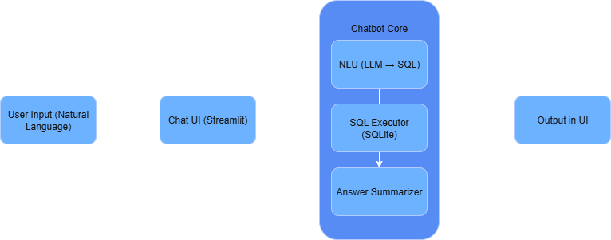
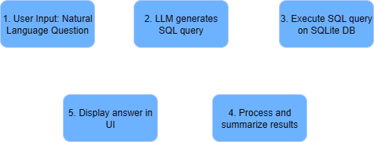
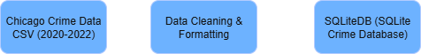

# Crime Data Chatbot — Project Report
This project is a chatbot that lets users ask natural language questions about crime data in Chicago (2020–2022). It’s designed to return accurate, relevant answers by generating SQL queries on the fly and turning the results into clear, contextual insights.

The goal is to make it easier for anyone to explore real data without needing technical knowledge — just ask a question and get meaningful information back, through a simple and intuitive chat interface.

# Architecture and Design Decisions

## High-Level Architecture

## Component Breakdown

### Data Pipeline

I started with the full Chicago crime dataset (2001–present), but filtered it down to the years 2020 to 2022. During the cleaning process, I removed all rows with `NaN` values, since they accounted for less than 1% of the dataset.

To avoid overloading the LLM API during development, I kept only the columns I considered essential for analysis and question answering:

`date`, `year`, `primary_type`, `description`, `location_description`, `community_area`, `arrest`, `domestic`.

After cleaning, the dataset was saved to a CSV file, and a script (`create_sql.py`) was used to convert it into a SQLite database, which serves as the foundation for the chatbot's SQL queries.

### Chatbot Core

The chatbot uses a lightweight LLM running locally (via Ollama) to interpret natural language questions and dynamically generate SQL queries. These queries are executed on the SQLite database, and the results are converted into clear, user-friendly responses.

### User Interface

The user interface was built with Streamlit to ensure a lightweight and interactive experience. Users can ask questions in free text and get immediate answers, with conversational history maintained during the session.

### Tech Stack

I prioritized open-source tools throughout the project:  
- **LLMs via Together.ai** and **Ollama** for local inference  
- **SQLite** for efficient and portable query execution  
- **Streamlit** for a quick, browser-based frontend

This choice supports transparency, portability, and cost-free deployment.

---

# Design Choices and Justifications

- **SQLite for local database:**  
  SQLite was selected due to its simplicity in setup, requiring no additional server or configuration. It provides efficient query performance suitable for the medium-sized dataset (around 600,000 rows after filtering). This choice ensures the solution remains lightweight and easy to reproduce across environments.

- **Dynamic SQL generation with LLM:**  
  To enable flexible and natural language querying, the chatbot dynamically generates SQL queries based on user input using a local large language model (LLM). This approach avoids hardcoded or template-based queries, allowing the user to ask a wide variety of questions without manual query writing.  
  Initially, a Retrieval-Augmented Generation (RAG) architecture using LangChain was considered to manage the large dataset and improve context handling. However, this was discarded because the RAG approach struggled with accuracy when responding to numerous and complex queries from the dataset. Instead, direct SQL generation combined with LLM summarization provided better precision and consistency.

- **Streamlit UI:**  
  Streamlit was chosen for its minimal dependencies and rapid development cycle, enabling a clean and intuitive chat-like interface. This allows quick iteration and testing without over-engineering the UI or introducing unnecessary complexity.

- **Validation approach:**  
  Validation involved creating a JSON file containing 12 carefully curated question-and-answer pairs covering a range of typical user queries about Chicago crime data from 2020 to 2022.  
  The chatbot’s answers were validated manually and programmatically using a Jupyter notebook included in the repository. Additionally, off-topic and out-of-scope questions were tested to verify that the chatbot appropriately handles such queries without producing misleading or irrelevant responses. This ensured robustness and reliability in real-world usage.

# Diagrams and Flowcharts

## 3.1 System Flowchart

## 3.2 Data Pipeline Overview

# Validation and Testing

- A dedicated validation file (`validation/questions.json`) was created containing 12 carefully selected natural language questions along with their verified answers. These questions were crafted based on a deep understanding of the dataset, covering various crime types, locations, years, and specific details.

- The validation process included both manual and automated checks using a Jupyter notebook (`validation/validate.ipynb`).

- The chatbot achieved an accuracy of approximately **91%** (10 out of 11 questions answered correctly), surpassing the project's acceptance threshold of 80%. Two question were intentionally designed to be out-of-scope to verify that the chatbot gracefully handles unsupported queries without providing misleading answers.

- Example questions tested include:
  - *"How many robberies were reported on March 5th of 2021?"*  
    **Expected answer:** "There were 106 robberies reported on March 5th of 2021."

  - *"Compare the number of robberies between Community Area 15 and Community Area 24 in the year 2022."*  
    **Expected answer:** "There were 63 robberies in Community Area 15 and 407 in Community Area 24 in the year 2022."

  - *"What was the most common crime type reported in 2020?"*  
    **Expected answer:** "The most common crime type reported in 2020 was BATTERY."

  - *"What is the average police response time for robberies in 2021?"*  
    **Expected answer:** "Average police response time is not available in the dataset."

- This structured validation approach ensured the chatbot not only returns accurate, data-driven responses but also handles questions outside the dataset’s scope responsibly, increasing overall robustness and user trust.

- The full JSON question-answer file and validation notebook are available in the `validation` folder of the repository for transparency and reproducibility.

# Appendix
- Dataset source: [Chicago Crime Data](https://data.cityofchicago.org/Public-Safety/Crimes-2001-to-Present/ijzp-q8t2/about_data)

- Validation notebook: validate.ipynb
